# Exercise Z3

- [x] Follow the [Z3 Playground](https://jfmc.github.io/z3-play/) up to Bitvectors (don't read Bitvectors).

> :warning: Some browsers might not run the playground properly. Safari is a browser we know doesn't work well. Chrome, Chromium, Firefox, and Brave browsers have been tested to work fine.

- [x] Use Z3 to find a solution for the following puzzle:
 

 Solution:
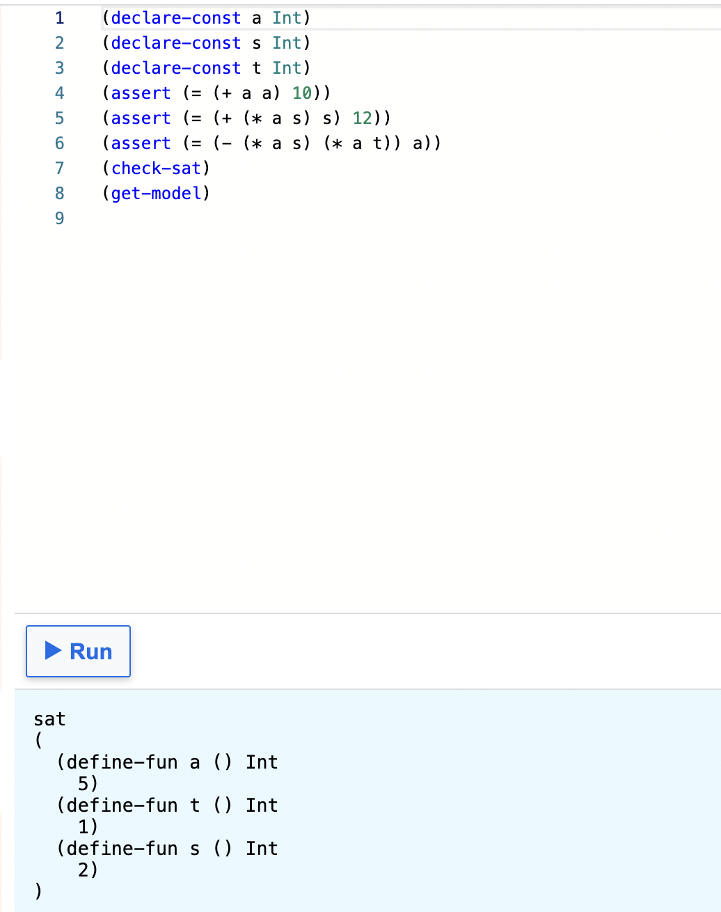
Answer: 2 
 
 

- [x] Write a formula to check if the following two equations are equivalent:
 

 Solution:
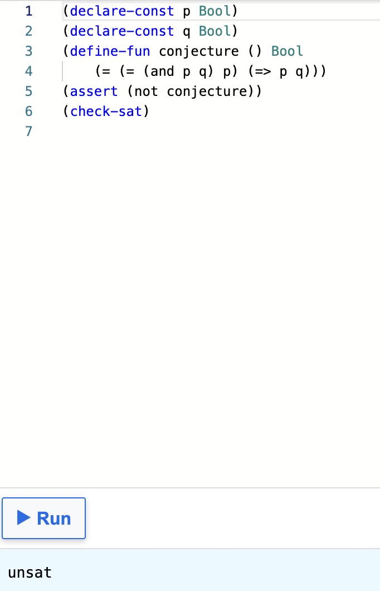
Answer: yes, they are equivalent 
 
 

- [x] A good additional practice will be to try and prove questions in [this file](AdditionalExerciseForSMT.pdf)
 
Q 1 Solution:
 
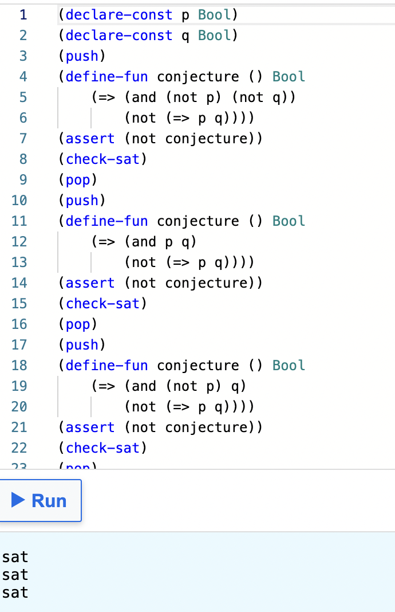
 
Answer: D, None of the above 
 

 
Q 2 Solution:
 
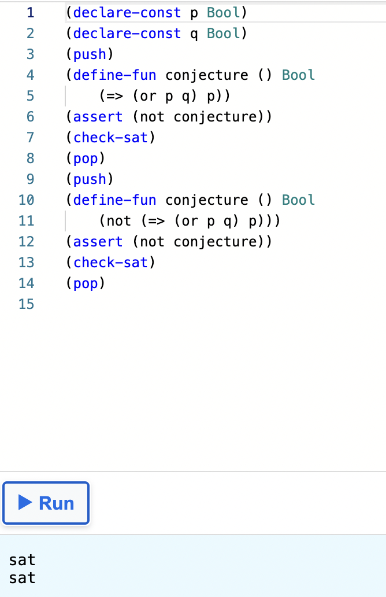
 
Answer: C, True for some cases and false for other cases
 

 
Q 3 Solution:
 
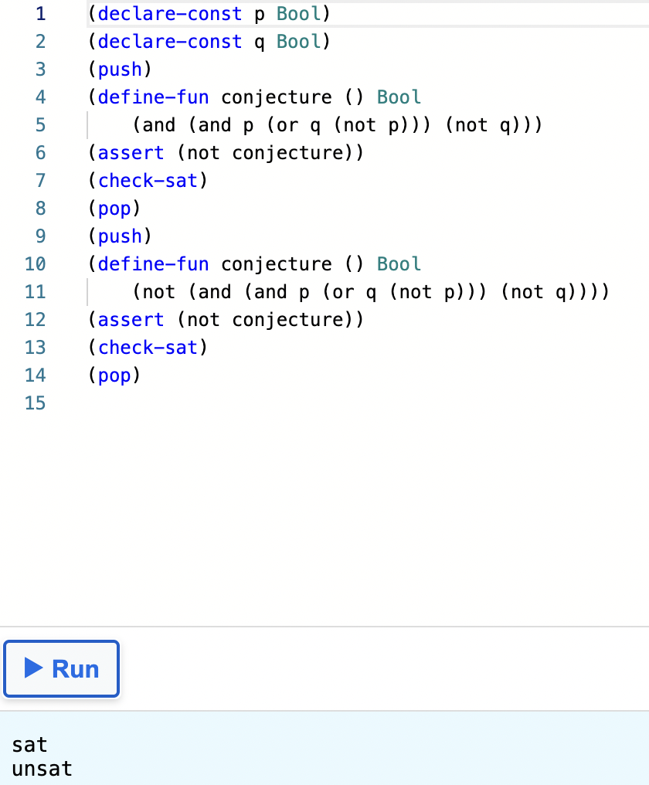
 
Answer: B, False in all cases
 

 
Q 4 Solution:
 
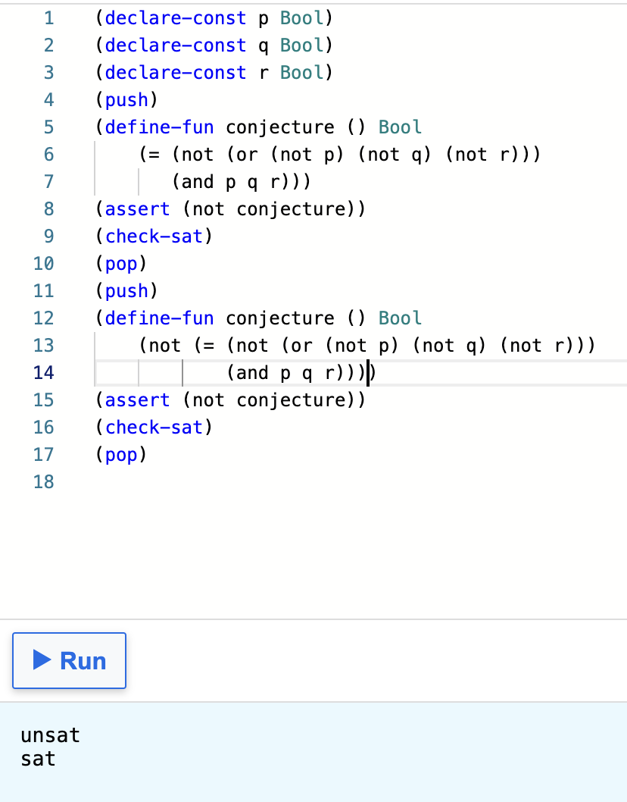
 
Answer: A, True in all cases 
 

 
Q 5 Solution:
 
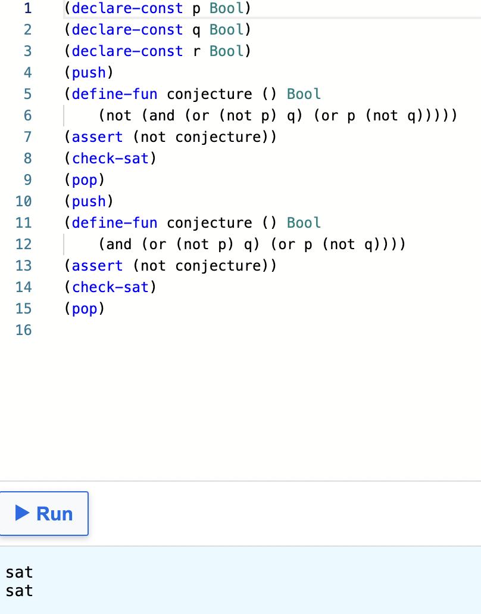
 
Answer: C, True for some cases and false for other cases
 

 
Q 6 Solution:
 
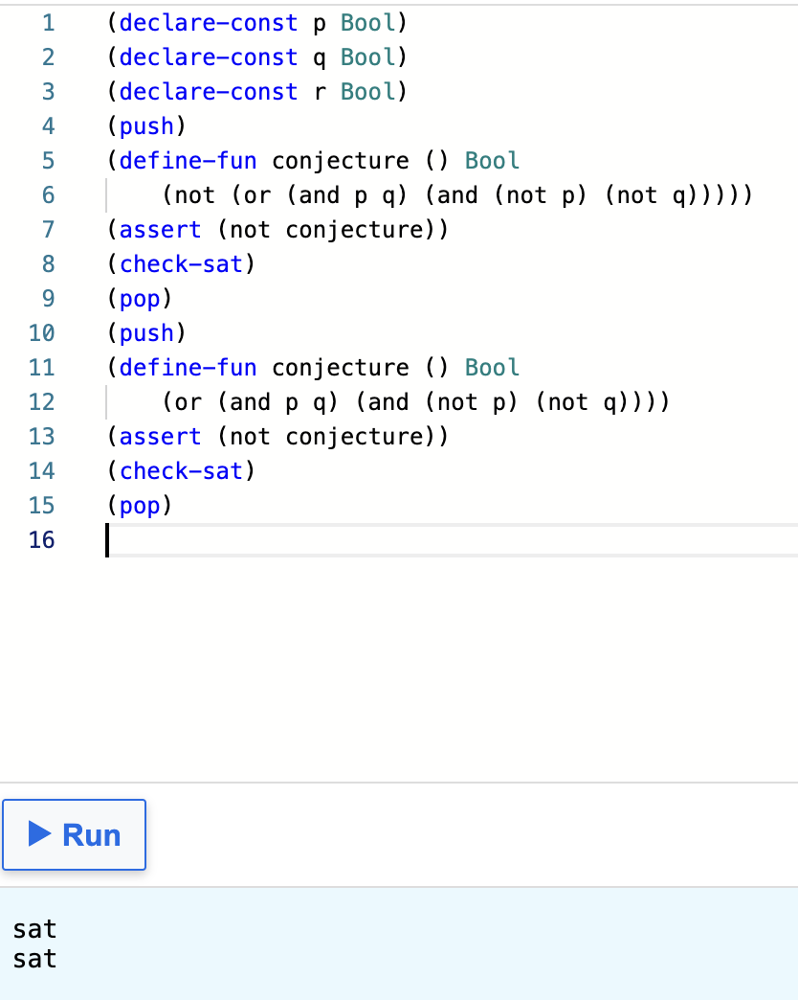
 
Answer: C, True for some cases and false for other cases
 

 
Q 7 Solution:
 
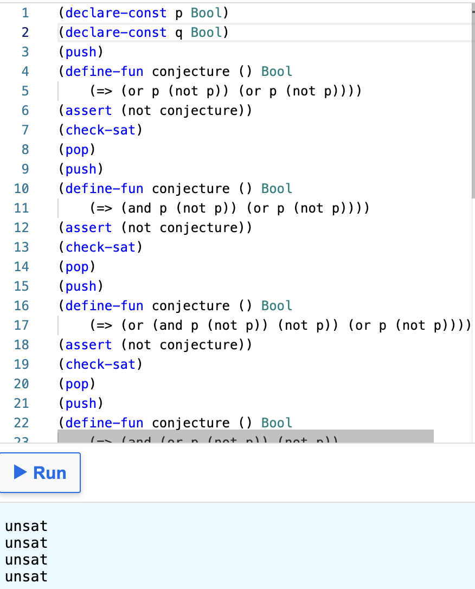
 
Answer: A, B, C, D
 

 
Q 8 Solution:
 
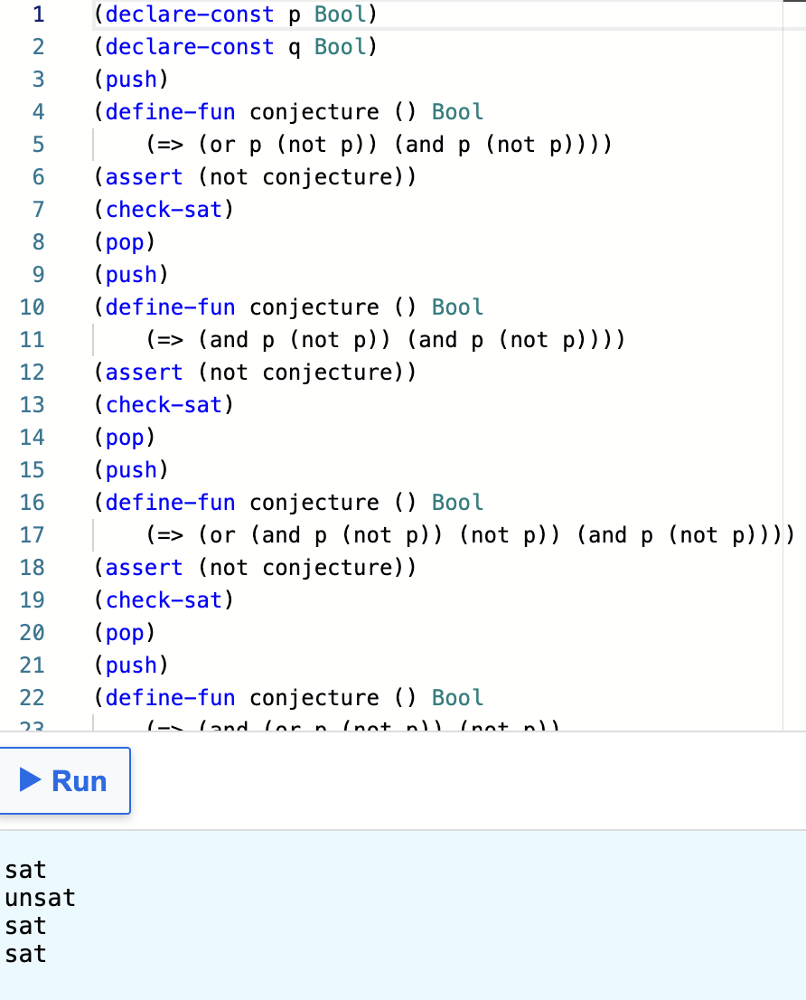
 
Answer: B
 

 
Q 9 Solution:
 
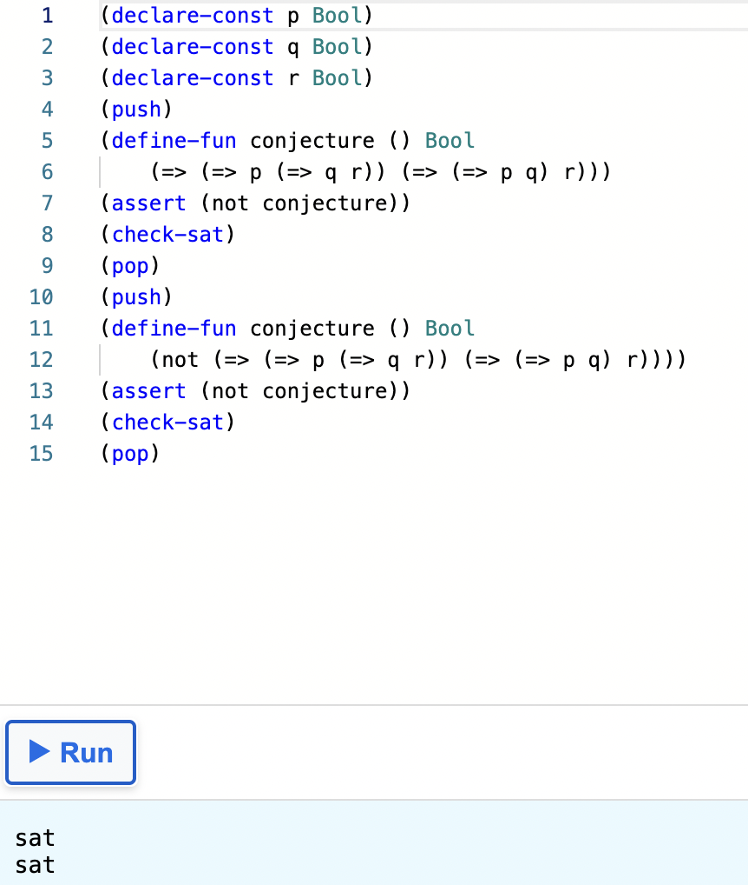
 
Answer: C, True for some cases and false for other cases
 

 
Q 10 Solution:
 
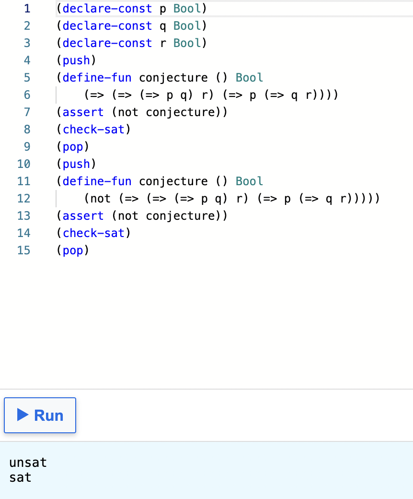
Answer: A, True in all cases
 
 

> :information_source: You might find the [cheat sheet](Cheat_Sheet.md) useful for the exercises and additional explanations of the Z3 principles.
